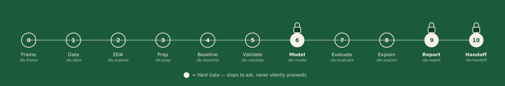
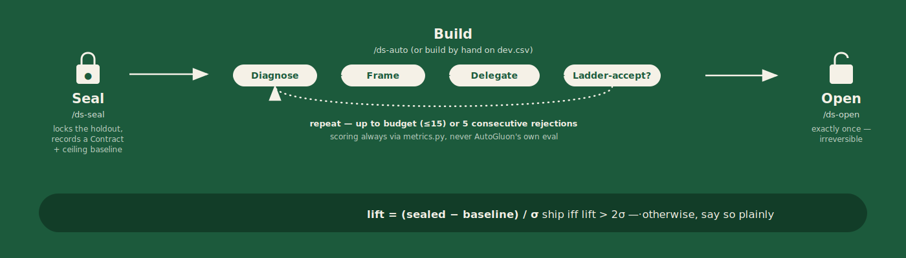

# 🏁 Last DS Mile

<p align="center">
  <a href="LICENSE"></a>
  <a href="https://claude.com/claude-code"></a>
  <a href="package.json"></a>
</p>

**Last DS Mile** is a guided data-science lifecycle for [Claude Code](https://claude.com/claude-code) — frame, explore, baseline, validate, model, evaluate, and report — with leakage and honesty checks built into every stage.

If you want an agent that won't quietly let a leaky feature, an inflated metric, or an unreproducible notebook slip through, this is it.

[Quickstart](#quickstart-60-second-setup) · [Why](#why) · [The pipeline](#the-pipeline) · [Sealed Bet](#the-sealed-bet-experimental) · [Security](#security-model) · [Development](#development) · [The Last AI Mile](https://thelastaimile.substack.com)

New here? Start with the Quickstart below, then run `/ds-frame` in Claude Code.

## Quickstart (60-second setup)

**Option A — one command, from any terminal (recommended):**

```bash
npx stamkavid/last-ds-mile
```

This finds your `claude` CLI, adds the marketplace, and installs the plugin —
no npm publish, no account, nothing to configure first.

**Option B — inside Claude Code:**

```
/plugin marketplace add stamkavid/last-ds-mile
/plugin install last-ds-mile
```

Either way, once it's installed: open Claude Code in any project and run
`/ds-frame` to start the pipeline, or `/ds` at any point to see the map and get
routed to the next stage.

**Requirements:** [Claude Code](https://claude.com/claude-code) (either option),
plus [Node.js](https://nodejs.org) 18+ if you use the `npx` one-liner.

**Troubleshooting:** if `claude plugin install` fails with `Permission denied
(publickey)` or another SSH clone error, it's trying to clone over SSH but you
likely use HTTPS-based GitHub auth (no SSH key registered). Fix once, globally:

```bash
git config --global url."https://github.com/".insteadOf git@github.com:
```

then re-run the install command.

## Why

Data science projects don't die in the modeling cell. They die in the last mile: target
leakage, inflated metrics, a validation scheme that lied, results nobody trusts, and
notebooks nobody can rerun. This plugin walks you through the full lifecycle on a guided
rail, and enforces the discipline that keeps the results honest.

## Highlights

- **[11-stage guided pipeline](#the-pipeline)** — `/ds-frame` through `/ds-handoff`, with `/ds` always showing the map and routing you to what's next.
- **[3 Hard Gates](#discipline-not-just-steps)** — modeling, reporting, and handoff each stop to ask rather than silently proceed on a missing baseline, validation strategy, or slice analysis.
- **[8 domain skills](#domain-skills)** — auto-trigger on leakage, imbalance, and metric-selection risk whether or not you're mid-pipeline.
- **[The Sealed Bet (experimental)](#the-sealed-bet-experimental)** — a portable trust core: lock a holdout, build freely (autonomously, if you want), open it once, ship only on real lift.
- **[Safe by default](#security-model)** — 5 hooks (4 warn-only, 1 that physically blocks), 3 subagents, zero network calls in any hook.
- **[Learnings that resurface](#learnings)** — 4 curated failure/fix write-ups plus your own project-local captures, both surfaced automatically at the start of the session that needs them.

## The pipeline

<p align="center"></p>

| # | Command | Stage |
|---|---------|-------|
| 0 | `/ds-frame` | Problem framing |
| 1 | `/ds-data` | Data understanding |
| 2 | `/ds-explore` | EDA |
| 3 | `/ds-prep` | Cleaning + feature engineering |
| 4 | `/ds-baseline` | Honest baseline |
| 5 | `/ds-validate` | Validation design |
| 6 | `/ds-model` | Modeling |
| 7 | `/ds-evaluate` | Evaluation + error analysis |
| 8 | `/ds-explain` | Interpretation |
| 9 | `/ds-report` | Communication |
| 10 | `/ds-handoff` | Reproducibility & handoff |

Run `/ds` at any point to see the pipeline map and get routed to the next stage.

Each stage writes its output to `.last-ds-mile/stages/` in your project, so later stages
build on earlier ones and `/ds` can detect your progress.

## Discipline, not just steps

Three stages are Hard Gates and will stop to ask rather than silently proceed:
- `/ds-model` requires a baseline (`/ds-baseline`) and a validation strategy
  (`/ds-validate`) to exist first.
- `/ds-report` requires slice/subgroup performance from `/ds-evaluate`, not just one
  aggregate metric.
- `/ds-handoff` requires a pinned environment before packaging a model.

See `skills/ds-method/SKILL.md` for the full set of Red Flags and Rationalizations every
stage shares.

## Domain skills

These aren't slash commands — they auto-trigger by description match whenever a
situation calls for them, whether or not you're mid-pipeline:

| Skill | Fires when |
|---|---|
| `target-leakage-detection` | a metric looks too good on the first try, or a feature dominates importance |
| `validation-strategy` | setting up CV, or deciding whether hyperparameter tuning needs nested CV |
| `imbalanced-data` | a classification target is skewed and accuracy stops being trustworthy |
| `metric-selection` | choosing or defending an evaluation metric |
| `error-analysis` | a model's aggregate score looks fine but you need to know where it fails |
| `notebook-hygiene` | finishing exploratory work that will be shared or handed off |
| `dataframe-performance` | a pandas operation is slow, or deciding whether to reach for Polars |
| `data-viz-standards` | building EDA plots, or preparing stakeholder-facing figures and tables |

## The Sealed Bet (experimental)

<p align="center"></p>

A trust core you can run in any coding agent: `python -m sealed_bet.seal` locks a
holdout's labels and records a Contract (including a mandatory ceiling baseline —
a domain-benchmark number if you have one, an AutoGluon-fit proxy if you don't);
you build freely on the dev split — by hand, or autonomously via `/ds-auto`'s
bounded Build loop (diagnose the bias/variance regime, frame one concrete change,
delegate the fit to AutoGluon, Ladder-accept or reject, repeat up to budget or 5
consecutive rejections); then `python -m sealed_bet.score` opens the holdout
**once** and reports `lift = (sealed − baseline)/σ` — ship only if it beats the
dumb baseline by more than the noise (> 2σ). `seal()` also certifies its own
dev/held split by running the split-adversary as a non-blocking Probe, recording
the verdict in the Ledger — warn-only, so a failed probe never stops the seal.
The scoring/contract/ledger/Build-loop math itself has zero Claude-Code-only
imports, so it's portable to any agent. The physical Read-blocking (`seal_guard`
hook) is a Claude Code-specific hook this plugin ships, and it currently gates
the `Read` tool only — `Bash`/`Grep` are not gated, so a careless or malicious
agent could still `cat`/`grep` the sealed file directly and bypass the guard.
In Claude Code, use `/ds-seal`, `/ds-auto`, and `/ds-open`.

## Security model

This plugin ships a "safe set": hooks that scan for untrusted-input risk (a
poisoned CSV, a pickle file that executes code on load, a shell magic hidden in a
notebook), a sanitization gate built into `/ds-data`, and 3 subagents. 4 of the 5
hooks are **warn, don't block** — they never stop your work. The one exception is
`seal_guard.py`, which deliberately denies Read access to the sealed holdout
labels — that block is the physical basis of the Sealed Bet's trust guarantee
for the `Read` tool specifically; `Bash`/`Grep` are not yet gated (see AUDIT.md's
"Known limitation" note under `seal_guard.py`).
See [`AUDIT.md`](AUDIT.md) for exactly what each hook reads, writes, and calls
(nothing over the network, ever).

To adopt the recommended permission baseline in your own project, merge
[`settings-baseline.json`](settings-baseline.json) into your project's
`.claude/settings.json` (this plugin never modifies your settings automatically):

    cat settings-baseline.json
    # then merge its "permissions" block into your own settings.json by hand,
    # or with a JSON-merging tool if you already have one in your workflow.

### Subagents

| Subagent | Model | Use for |
|---|---|---|
| `leakage-auditor` | Opus | Adversarially hunting target/temporal/validation leakage before `/ds-model` or `/ds-report` |
| `ds-reviewer` | Sonnet | Running the discipline checklist (baseline, validation, metric, slices, reproducibility) before `/ds-report` |
| `data-profiler` | Haiku | Fast structural profiling sweep for `/ds-data` or `/ds-explore` |

## Learnings

Four real DS failure-and-fix write-ups ship in `lessons/`, cited from the
skills that teach the pattern they illustrate — read one alongside the skill
it's cited from for a concrete example, not just the abstract rule. Most of
them are also tagged to a pipeline stage, so it will surface automatically at
the start of a session heading into that stage.

Run `/ds-learn` to capture your own project-local lesson (what broke, what
fixed it) — it's appended to `.last-ds-mile/learnings.jsonl` and resurfaces
the same way: automatically, at the start of your next session, if it's
tagged to the stage you're about to work on. See the `capturing-learnings`
skill for what's worth capturing.

## Status

This release covers the full lifecycle spine, 8 domain skills (leakage detection,
validation strategy, imbalanced data, metric selection, error analysis, notebook
hygiene, dataframe performance, and data viz standards) that auto-trigger whenever a
matching situation comes up, and the safe set: 5 hooks, a documented permission
baseline, a real sanitization gate in `/ds-data`, `AUDIT.md`, and 3 subagents
(`leakage-auditor`, `ds-reviewer`, `data-profiler`). See [Security model](#security-model)
above. The learnings system ships too: a curated `lessons/` corpus (4 real DS
failure/fix write-ups, cited from the skills that teach them) and project-local
capture via `/ds-learn` — both resurface automatically at the start of your
next session if tagged to the stage you're about to work on. Cross-project
sharing of captured lessons is still on the roadmap.

The Sealed Bet now covers the full experimental trust-core arc: `/ds-seal` locks
the holdout and computes a mandatory ceiling baseline, `/ds-auto` runs the
autonomous Build loop, `/ds-open` settles the bet — once. A compliance-evidence
and cross-agent-adapter phase is on the roadmap, not yet designed.

## Development

    uv venv --python 3.13
    uv pip install -r requirements-dev.txt
    uv run pytest tests/ -v

Requires Python >=3.10,<3.14 — AutoGluon's `pyarrow` dependency has no
prebuilt wheel for 3.14 yet at time of writing, so the dev venv must stay on
3.13 or earlier until that catches up upstream.

`tests/test_plugin_structure.py` validates plugin structure (frontmatter, required
sections, command↔skill wiring, lesson citations); `tests/test_hooks.py`
unit-tests the runtime hooks' actual behavior via subprocess.

---

A product of [The Last AI Mile](https://thelastaimile.substack.com). Issues and
PRs welcome via the [GitHub repo](https://github.com/stamkavid/last-ds-mile).
