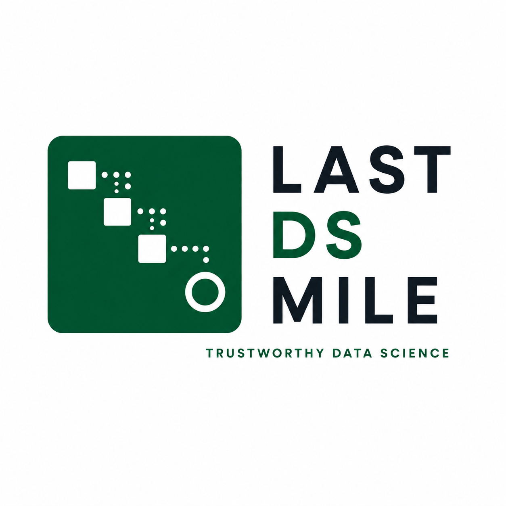
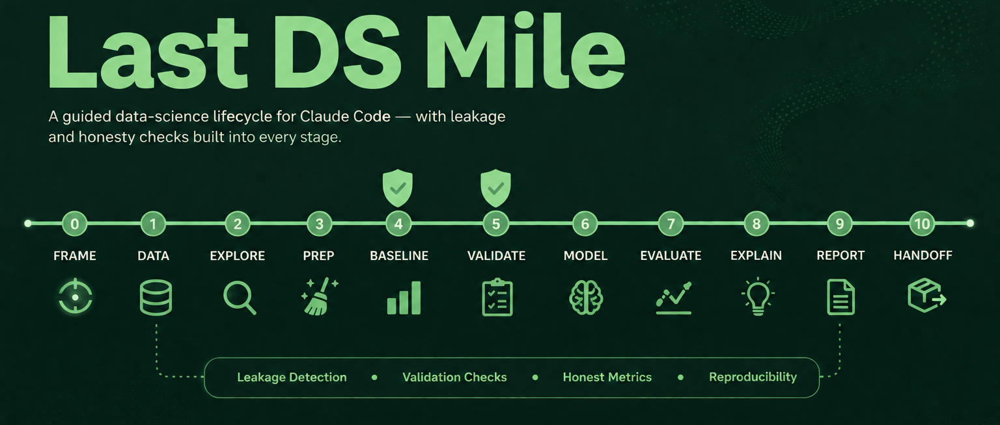
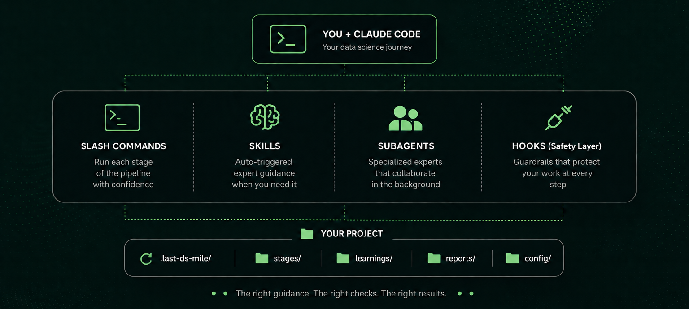

# Last DS Mile

<div align="center">
  
</div>

**Production-grade data science discipline for AI coding agents.**

Skills encode the workflows, honesty checks, and hard gates that experienced data scientists apply at every stage — from problem framing to reproducible handoff. Packaged so AI agents follow them consistently, instead of taking the shortest path to a metric that looks good.

A product of [The Last AI Mile](https://thelastaimile.substack.com).

---

<p align="center">
  
</p>

---

## Commands

17 slash commands — one navigator, 14 pipeline stages (including the `/ds-iterate` loop-back step), plus `/ds-learn` to capture project-local lessons and `/ds-brief` to translate `/ds-report` for a non-technical audience. Each activates the right skills automatically. Five stages are hard gates that stop and verify discipline before proceeding.

| What you're doing | Command | Key principle |
|-------------------|---------|---------------|
| Navigate the pipeline | `/ds` | Know where you are before the next step |
| Frame the problem | `/ds-frame` | Decide what winning looks like before touching data |
| Audit the data | `/ds-data` | Understand before transforming |
| Explore distributions and relationships | `/ds-explore` | Surface surprises before they become bugs |
| Clean and engineer features | `/ds-prep` | Features should represent what you know, not what you measured |
| Establish an honest baseline | `/ds-baseline` | Complexity must beat the dumbest thing that could work |
| Design the validation scheme | `/ds-validate` | The split is part of the model |
| Train models | `/ds-model` ⚠ | No model without a baseline and a validation plan |
| Evaluate with slices | `/ds-evaluate` | Aggregate scores lie; slice performance reveals |
| Diagnose and route back | `/ds-iterate` | One pass rarely finishes the job — name the gap, fix the right stage |
| Interpret results | `/ds-explain` | Explanation is evidence, not decoration |
| Communicate findings | `/ds-report` ⚠ | Slices and uncertainty, not one number |
| Package for handoff | `/ds-handoff` ⚠ | Pinned environment before shipping any model |
| Package to serve | `/ds-package` ⚠ | The served model must predict identically to the offline one |
| Deploy behind monitoring | `/ds-deploy` ⚠ | No production model without monitoring, drift, and a rollback |
| Capture a lesson | `/ds-learn` | What broke and what fixed it, for the next session |
| Brief a non-technical audience | `/ds-brief` | Translate the report, don't re-analyze — no jargon, one page |

The five ⚠ stages are **hard gates**: `/ds-model` requires a completed baseline and validation strategy to exist first; `/ds-report` requires subgroup performance, not just an aggregate metric; `/ds-handoff` requires a pinned environment before packaging a model; `/ds-package` requires the training/serving parity check to pass before the model is servable; `/ds-deploy` requires monitoring, drift detection, and a rollback pointer before a full-traffic deploy.

Each stage writes its output to `.last-ds-mile/stages/` in your project, so later stages build on earlier ones and `/ds` can always detect your progress.

---

## Quick Start

**Option A — one command, from any terminal (recommended):**

```bash
npx stamkavid/last-ds-mile
```

This finds your `claude` CLI, adds the marketplace, and installs the plugin — no npm publish, no account, nothing to configure first.

**Option B — inside Claude Code:**

```
/plugin marketplace add stamkavid/last-ds-mile
/plugin install last-ds-mile
```

Once installed, open Claude Code in any project and run `/ds-frame` to start the pipeline, or `/ds` at any point to see the map and get routed to the next stage.

**Requirements:** [Claude Code](https://claude.com/claude-code) (either option), plus [Node.js](https://nodejs.org) 18+ for the `npx` one-liner.

<details>
<summary><b>Troubleshooting: SSH clone errors</b></summary>

If `claude plugin install` fails with `Permission denied (publickey)` or another SSH clone error, it's trying to clone over SSH but you likely use HTTPS-based GitHub auth. Fix once, globally:

```bash
git config --global url."https://github.com/".insteadOf git@github.com:
```

then re-run the install command.

</details>

---

## All 30 Skills

The commands above are entry points. Behind them are 30 skills total — 15 pipeline skills (now including `ds-package` and `ds-deploy` for the deployment mile), 12 domain skills that auto-trigger by situation, 2 shared methodology skills, and 1 entry-point skill (`data-science-project`) that auto-routes a cold-start user into the pipeline before any data or model is touched. Each skill is a structured workflow with steps, verification gates, and anti-rationalization tables. You can reference any skill directly.

### Navigate — Find your stage

| Skill | What It Does | Use When |
|-------|-------------|----------|
| [ds-method](skills/ds-method/SKILL.md) | Shared discipline layer — the Red Flags, Rationalizations, and Hard Gates every stage inherits | Running any pipeline stage, or when asked to skip a gate |

### Frame — Define the problem

| Skill | What It Does | Use When |
|-------|-------------|----------|
| [ds-frame](skills/ds-frame/SKILL.md) | Frame the business problem, define success criteria, and agree on what winning looks like before any data is touched | Starting a project or when the goal is unclear |

### Understand — Know your data

| Skill | What It Does | Use When |
|-------|-------------|----------|
| [ds-data](skills/ds-data/SKILL.md) | Audit data quality, surface structural issues, detect sanitization risks, and understand what each row actually represents | Before any feature engineering or modeling |
| [ds-explore](skills/ds-explore/SKILL.md) | EDA — distributions, correlations, class balance, temporal patterns, anomalies — with visualization standards built in | Between data audit and feature engineering |

### Prepare — Build honest features

| Skill | What It Does | Use When |
|-------|-------------|----------|
| [ds-prep](skills/ds-prep/SKILL.md) | Clean, transform, and engineer features while flagging leakage risk on every column that touches the target | Before modeling |
| [ds-baseline](skills/ds-baseline/SKILL.md) | Build and record the dumbest thing that could work — dummy classifier, simple heuristic — before reaching for complexity | Before any model training |
| [ds-validate](skills/ds-validate/SKILL.md) | Design the train/validation/test split for your data type — holdout, k-fold, stratified, time-ordered — and document why | Before model training; required before `/ds-model` |

### Model — Train with discipline

| Skill | What It Does | Use When |
|-------|-------------|----------|
| [ds-model](skills/ds-model/SKILL.md) | Train candidates against the validated baseline, track all experiments with fold spread, diagnose bias vs. variance, consider ensembling, and refuse to proceed without a baseline and validation plan ⚠ | After baseline and validation are confirmed |

### Evaluate — Prove it works

| Skill | What It Does | Use When |
|-------|-------------|----------|
| [ds-evaluate](skills/ds-evaluate/SKILL.md) | Evaluate on held-out data with slices, subgroups, and protected-attribute checks, run error analysis, check calibration, and compare against the baseline | After training; required before `/ds-report` |
| [ds-iterate](skills/ds-iterate/SKILL.md) | Diagnose `/ds-evaluate`'s findings (bias, variance, a slice weakness, leakage, or shift) and route back to the exact stage that fixes it, or confirm the result is ready to proceed | After every `/ds-evaluate` pass, before `/ds-explain` |
| [ds-explain](skills/ds-explain/SKILL.md) | Interpret model behavior with feature importance, SHAP, and partial dependence — then sanity-check the explanation against domain knowledge | Before any stakeholder communication |

### Communicate & Ship

| Skill | What It Does | Use When |
|-------|-------------|----------|
| [ds-report](skills/ds-report/SKILL.md) | Build the findings report with uncertainty, subgroup performance, the metric lift translated into `/ds-frame`'s cost terms, and limitations — requires slice results, not just aggregate metrics ⚠ | After full evaluation |
| [ds-brief](skills/ds-brief/SKILL.md) | Translate `/ds-report` into a one-page, jargon-free brief — no metric names, dollar/percentage/count framing only | Explaining results to executives or any non-technical audience |
| [ds-handoff](skills/ds-handoff/SKILL.md) | Pin the environment, write the reproduction guide, package artifacts, and verify results replicate before handing off ⚠ | Finishing a project or transferring ownership |

---

## Domain Skills

These don't correspond to slash commands. They auto-trigger when a situation calls for them — during any pipeline stage — based on description match:

| Skill | Fires when |
|-------|-----------|
| [target-leakage-detection](skills/target-leakage-detection/SKILL.md) | A metric looks too good on the first try, or a single feature dominates importance |
| [validation-strategy](skills/validation-strategy/SKILL.md) | Setting up cross-validation, or deciding whether hyperparameter tuning needs nested CV |
| [distribution-shift](skills/distribution-shift/SKILL.md) | A fixed test set or deployment population may not match training data, or CV looked fine but a holdout/production score didn't |
| [uncertainty-quantification](skills/uncertainty-quantification/SKILL.md) | Reporting or comparing CV scores — every metric needs a spread, not a bare point estimate |
| [model-ensembling](skills/model-ensembling/SKILL.md) | Two or more structurally different candidates exist and a single model's score has plateaued |
| [causal-vs-predictive](skills/causal-vs-predictive/SKILL.md) | A driver finding gets worded as "reduces/causes/drives," or a recommendation implies intervening on a feature rather than just ranking with it |
| [imbalanced-data](skills/imbalanced-data/SKILL.md) | A classification target is skewed and accuracy stops being meaningful |
| [metric-selection](skills/metric-selection/SKILL.md) | Choosing or defending an evaluation metric against stakeholder pressure |
| [error-analysis](skills/error-analysis/SKILL.md) | An aggregate score looks fine but you need to know where the model actually fails |
| [notebook-hygiene](skills/notebook-hygiene/SKILL.md) | Finishing exploratory work that will be shared or handed off |
| [dataframe-performance](skills/dataframe-performance/SKILL.md) | A pandas operation is slow, or deciding whether to reach for Polars or chunked processing |
| [data-viz-standards](skills/data-viz-standards/SKILL.md) | Building EDA plots or preparing stakeholder-facing figures and tables |

---

## Subagents

Three specialist agents that pipeline skills invoke for targeted, focused analysis:

| Subagent | Model | Use for |
|----------|-------|---------|
| [leakage-auditor](agents/leakage-auditor.md) | Opus | Adversarially hunting target, temporal, and validation leakage before `/ds-model` or `/ds-report` |
| [ds-reviewer](agents/ds-reviewer.md) | Sonnet | Running the full discipline checklist — baseline, validation, metric, slices, reproducibility — before `/ds-report` |
| [data-profiler](agents/data-profiler.md) | Haiku | Fast structural profiling sweep during `/ds-data` or `/ds-explore` |

---

## How Skills Work

Every skill follows a consistent anatomy:

```
┌─────────────────────────────────────────────────┐
│  SKILL.md                                       │
│                                                 │
│  ┌─ Frontmatter ─────────────────────────────┐  │
│  │ name: ds-skill-name                       │  │
│  │ description: Guides agents through [task].│  │
│  │              Fires when…                  │  │
│  └───────────────────────────────────────────┘  │
│  Overview         → What this skill does        │
│  When to Use      → Triggering conditions       │
│  Process          → Step-by-step workflow       │
│  Rationalizations → Excuses + rebuttals         │
│  Red Flags        → Signs something's wrong     │
│  Verification     → Evidence requirements       │
└─────────────────────────────────────────────────┘
```

---

<p align="center">
  
</p>

---

**Key design choices:**

- **Process, not reference.** Skills are workflows agents follow, not documentation they read. Each has steps, checkpoints, and exit criteria.
- **Hard gates, not suggestions.** Three stages check for prior-stage evidence — a baseline, a validation plan, a pinned environment — and stop to tell the agent (and you) exactly what's missing rather than proceeding around it. Enforcement is by warning and stopping to ask, matching this plugin's warn-never-block safety posture (see `ds-method` and [Safety](#safety)), not by a mechanism that can silently block you.
- **Anti-rationalization built in.** Every skill includes a table of excuses agents (and humans) use to skip steps — "the metric looks fine", "I'll validate later" — with documented counter-arguments.
- **Verification is non-negotiable.** Every skill ends with evidence requirements. "Seems reasonable" is never sufficient — there must be slice results, a baseline comparison, a locked environment file.

---

## Project Structure

```
last-ds-mile/
├── skills/                          # 30 skills total
│   ├── ds-method/                   #   Shared discipline layer (meta)
│   ├── ds-frame/                    #   Frame
│   ├── ds-data/                     #   Understand
│   ├── ds-explore/                  #   Understand
│   ├── ds-prep/                     #   Prepare
│   ├── ds-baseline/                 #   Prepare
│   ├── ds-validate/                 #   Prepare
│   ├── ds-model/                    #   Model      ⚠ Hard gate
│   ├── ds-evaluate/                 #   Evaluate
│   ├── ds-iterate/                  #   Evaluate   (loop back or proceed)
│   ├── ds-explain/                  #   Evaluate
│   ├── ds-report/                   #   Ship       ⚠ Hard gate
│   ├── ds-brief/                    #   Ship       (non-technical translation)
│   ├── ds-handoff/                  #   Ship       ⚠ Hard gate
│   ├── target-leakage-detection/    #   Domain (auto-trigger)
│   ├── validation-strategy/         #   Domain (auto-trigger)
│   ├── distribution-shift/          #   Domain (auto-trigger)
│   ├── uncertainty-quantification/  #   Domain (auto-trigger)
│   ├── model-ensembling/            #   Domain (auto-trigger)
│   ├── causal-vs-predictive/        #   Domain (auto-trigger)
│   ├── imbalanced-data/             #   Domain (auto-trigger)
│   ├── metric-selection/            #   Domain (auto-trigger)
│   ├── error-analysis/              #   Domain (auto-trigger)
│   ├── notebook-hygiene/            #   Domain (auto-trigger)
│   ├── dataframe-performance/       #   Domain (auto-trigger)
│   ├── data-viz-standards/          #   Domain (auto-trigger)
│   └── capturing-learnings/         #   Capture project-local lessons
├── agents/                          # 3 specialist subagents
├── commands/                        # 15 slash commands
├── hooks/                           # Session lifecycle hooks (warn, never block)
├── lessons/                         # 6 real DS failure-and-fix write-ups
├── benchmarks/                      # Full pipeline runs on 3 public datasets
├── showcase/                        # Curated figures from the benchmark runs
├── tests/                           # Plugin structure + hook behavior tests
├── settings-baseline.json           # Opt-in permission baseline
└── AUDIT.md                         # What every hook reads, writes, and calls
```

---

## Why Last DS Mile?

Data science projects don't fail in the modeling cell. They fail in the last mile: target leakage that inflates a metric, a validation scheme that trains on the future, evaluation that reports one aggregate number while hiding where the model fails, and notebooks that can't be rerun six months later.

AI coding agents make this worse by default — they optimize for a result that looks right quickly, skipping the steps that reveal whether the result *is* right. Last DS Mile gives agents structured workflows with checkpoints that match how experienced data scientists actually work: baselines before complexity, honest splits before training, slices before reporting.

Four principles run through every stage:

- **Leakage first.** Target leakage, temporal leakage, and validation leakage are actively hunted — not left to chance. The `leakage-auditor` subagent is available for adversarial review before any model ships.
- **Baselines are required, not optional.** A model that doesn't beat the simplest thing that could work has proven nothing. `/ds-baseline` is a hard prerequisite for `/ds-model`.
- **Aggregate scores are not enough.** Slice performance (including protected/sensitive attributes where relevant), calibration, and error analysis are required before any model ships. `/ds-evaluate` results are a hard prerequisite for `/ds-report`.
- **A point estimate is not a finding.** Every reported metric carries its fold spread, and a lift over baseline is only real if it exceeds that spread — see `uncertainty-quantification`. One pass through evaluation is also rarely the end: `/ds-iterate` diagnoses what's actually wrong and routes back to the stage that fixes it before the pipeline is allowed to call itself done.

---

## Learnings

Six real failure-and-fix write-ups ship in `lessons/`, cited from the skills that teach the pattern they illustrate. Read one alongside the skill it's cited from for a concrete example, not just the abstract rule. Each is tagged to a pipeline stage and surfaces automatically at the start of a session heading into that stage.

| Lesson | Pattern |
|--------|---------|
| [the-time-traveling-feature.md](lessons/the-time-traveling-feature.md) | Temporal leakage hidden in a join |
| [the-99-percent-fraud-model.md](lessons/the-99-percent-fraud-model.md) | Class imbalance masking a useless model |
| [the-leaderboard-that-lied.md](lessons/the-leaderboard-that-lied.md) | Validation leakage via repeated k-fold tuning |
| [the-notebook-nobody-could-rerun.md](lessons/the-notebook-nobody-could-rerun.md) | Reproducibility failure at handoff |
| [the-imbalance-knob-that-broke-silently.md](lessons/the-imbalance-knob-that-broke-silently.md) | A library-specific imbalance parameter collapsing at an extreme ratio |
| [the-contract-that-wasnt-the-cause.md](lessons/the-contract-that-wasnt-the-cause.md) | A correlational finding written up as a confirmed causal claim |

Run `/ds-learn` to capture your own project-local lesson — what broke and what fixed it. It's appended to `.last-ds-mile/learnings.jsonl` and resurfaces the same way at the relevant stage. See the [capturing-learnings](skills/capturing-learnings/SKILL.md) skill for what's worth capturing.

---

## Benchmarks

Three real datasets, each taken through the full `/ds-frame`→`/ds-handoff` pipeline, not just described in the abstract — proof the discipline produces real, reliable numbers rather than plausible-sounding prose. Full evidence trail for each run lives in [`benchmarks/`](benchmarks/); a curated set of figures is in [`showcase/`](showcase/).

| Dataset | Problem | Shipped model | Score | 5-seed reliability | vs. published reference |
|---|---|---|---|---|---|
| [House Prices](benchmarks/house-prices/) | Regression | Blend (LightGBM + CatBoost-native) | RMSE 0.1244 ± 0.0141 | mean 0.1228, **seed std 0.0014** | 0.11–0.12 is "solid"; matches |
| [Telco Churn](benchmarks/telco-churn/) | Classification (26.5% positive) | Blend (LogReg + CatBoost-native) | ROC-AUC 0.8477 ± 0.0113 | mean 0.8477, **seed std 0.0004** | ~0.84–0.86 published; matches |
| [Credit Card Fraud](benchmarks/credit-card-fraud/) | Classification (0.17% positive) | Blend (LightGBM + CatBoost) | PR-AUC 0.8455 ± 0.0117 | mean 0.8465, **seed std 0.0010** | ~0.85–0.87 published; matches |

**Reliability, checked, not assumed:** each score was verified across 5 independent CV-splitter seeds. In every case the seed-to-seed standard deviation is 10–30x smaller than the within-run fold-to-fold standard deviation — the number is a stable property of the model and data, not a lucky split. Each score also lands inside independently published reference ranges for its dataset, an external check, not just an internally consistent one.

**Reproducibility, checked, not assumed:** each dataset's model-comparison script, evaluation script, and seed-reliability script were written separately, share only the dataset's `pipeline_lib.py`, and were each rerun fresh on demand — every run agrees with every other run to 4 decimal places. That agreement is recorded per-dataset in each `10-handoff.md`.

Two real problems were caught and fixed during these runs, not glossed over — see the two newest entries in Learnings above. Both are now permanent checks in the pipeline, not one-off patches.

To reproduce any run: `cd benchmarks/<dataset> && python scripts/model.py` (candidate comparison) `&& python scripts/evaluate.py` (OOF evaluation + figures) `&& python scripts/explain.py` (interpretation) — see `requirements-lock.txt` in each folder for the exact pinned environment.

---

## Safety

This plugin ships four hooks that **warn, never block** — none of them can stop your work:

- **Untrusted-input scan** — warns before loading a CSV with embedded shell characters, a pickle that executes code on load, or a shell magic hidden in a notebook cell.
- **Session learnings injection** — surfaces relevant prior lessons at session start.
- **Pre-compaction state** — persists pipeline state before Claude compacts context.
- **Session note capture** — saves a note on stop for continuity.

A sanitization gate is also built into `/ds-data`. The opt-in permission baseline lives in [`settings-baseline.json`](settings-baseline.json) — this plugin **never modifies your settings automatically**. See [`AUDIT.md`](AUDIT.md) for exactly what each hook reads, writes, and calls. Nothing over the network, ever. Nothing beyond the Python standard library.

To adopt the recommended permission baseline, merge its `"permissions"` block into your project's `.claude/settings.json`:

```bash
cat settings-baseline.json
```

---

## Scope

Worth knowing before you install:

- **Tabular supervised learning.** Regression and classification on rows and columns via pandas and scikit-learn. No text, vision, recommenders, or time-series forecasting — time-ordered data is handled as a splitting and leakage concern, not a forecasting stack.
- **The deployment mile is local-first.** `/ds-package` proves training/serving parity and produces a reproducible Dockerfile; `/ds-deploy` stands the model up as a local endpoint with monitoring, drift detection, and a rollback pointer. Cloud targets are documented adapter stubs you fill in — the plugin never pushes to a remote on its own. **Automated retraining triggers are the one part still on the roadmap.**

---

## Development

The hooks are pure-standard-library Python 3 — no dependencies, no build step. The only test dependencies are `pytest` and `PyYAML` (used to parse `SKILL.md` frontmatter):

```bash
python -m pip install pytest pyyaml
python -m pytest
```

`tests/test_plugin_structure.py` validates plugin structure (frontmatter, required sections, command↔skill wiring, lesson citations). `tests/test_hooks.py` unit-tests the runtime hooks via subprocess. CI runs both on Python 3.10–3.13.

---

## License

MIT — use these skills in your projects, teams, and tools.
