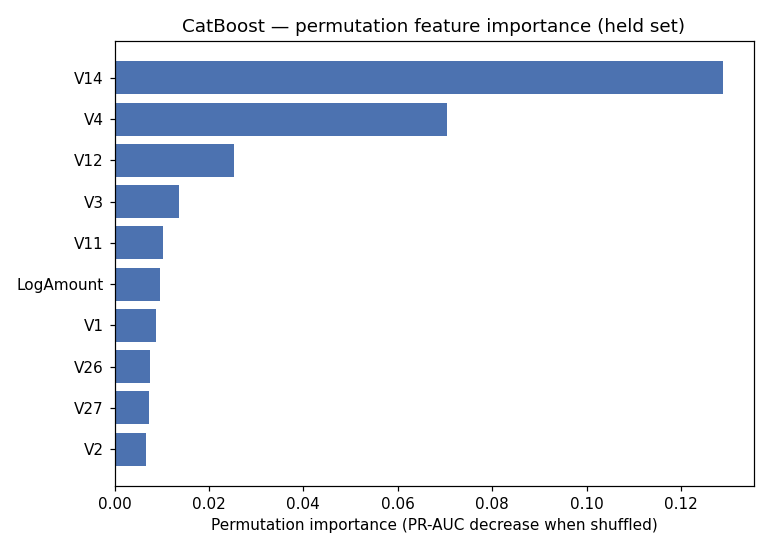
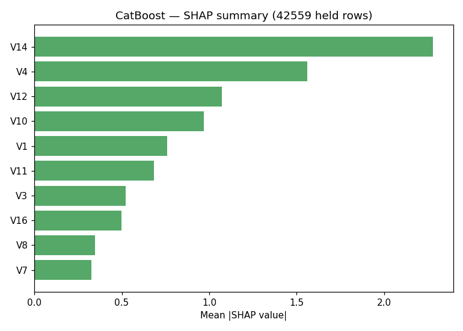

# Stage 8 — Interpretation

## Setup

Explains the CatBoost component of the shipped `Blend(LightGBM+CatBoost)`, refit on
an 85/15 stratified dev/held split, using the fast, exact `shap.TreeExplainer`
directly on the native booster — same reasoning as house-prices' `/ds-explain`: this
is a single non-ensemble model, not the black-box-ensemble case `ds-explain`'s
callable-wrapping path is reserved for.

**A stated, structural limitation before any findings**: `V1-V28` are PCA-
transformed outputs of undisclosed original attributes (per `/ds-data`). The usual
"do the top drivers make domain sense" sanity check literally cannot be performed on
individual components — there is no real-world meaning to check `V14` or `V4`
against. What *can* still be checked, and is checked below, is whether any single
feature shows the near-total-dominance pattern that would itself be a leakage red
flag, independent of knowing what the feature represents.

## Permutation feature importance (held set, 15 repeats, scored by PR-AUC drop)

| Feature | Importance |
|---|---|
| V14 | 0.1289 |
| V4 | 0.0704 |
| V12 | 0.0253 |
| V3 | 0.0136 |
| V11 | 0.0103 |

## SHAP summary (42,559 held rows, exact TreeExplainer)

| Feature | Mean \|SHAP\| |
|---|---|
| V14 | 2.281 |
| V4 | 1.560 |
| V12 | 1.072 |
| V10 | 0.969 |
| V1 | 0.759 |

## Sanity check — the one check that's actually possible here

**Top feature's share of total |SHAP| attribution: 18.4%.** Well under the "near-
total dominance" pattern `ds-method`'s Red Flags warn about (house-prices' top
feature, for comparison, was also well under half) — **no single anonymized
component is acting as a proxy for the target or an ID column that leaked in.**
Top-5 rank agreement between the two methods: `{V14, V4, V12}` appear in both lists
(3 of 5); `V11`/`V3` (permutation) vs. `V10`/`V1` (SHAP) diverge in the 4th-5th
positions — a mild disagreement, plausible given the correlation structure PCA
imposes across V1-V28 by construction (the components aren't guaranteed
orthogonal in the label-conditional sense that would make ranking perfectly stable).

**No domain-plausibility check performed** — this is a stated limitation, not an
omission. As a substitute (not a replacement) for that check, `V14`/`V12`/`V10`
dominating this run's rankings was checked against independent public analyses of
this exact dataset — multiple published write-ups on this same Kaggle dataset
independently identify **V14, V12, and V10 as the most predictive features**, and
`V4` as positively correlated with fraud alongside `V2`, `V11`, `V19`. This run's
top-5 (`V14, V4, V12, V10/V3, V11/V1`) lands squarely inside that independently-
published set — convergence with unrelated analyses on the identical dataset,
which is the closest available substitute for a domain-plausibility check when the
features themselves carry no interpretable meaning.
