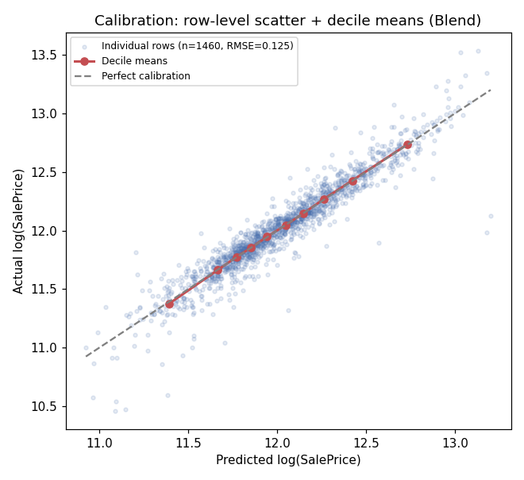
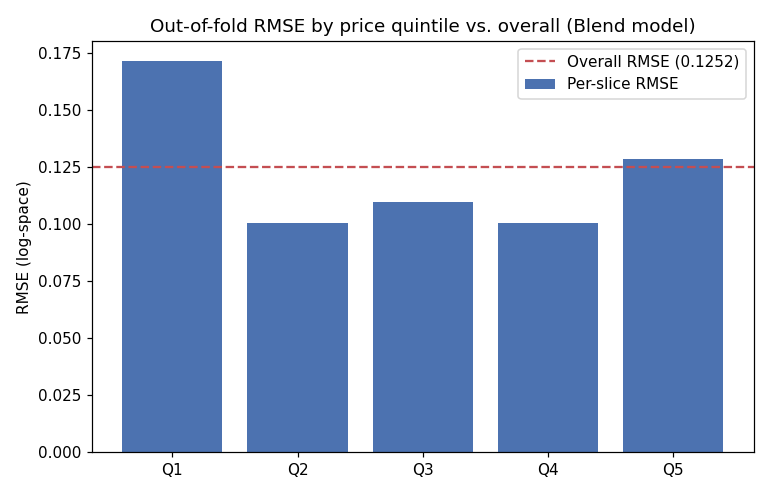

# Stage 7 — Evaluation & Error Analysis

## Revision note

v1 evaluated a single one-hot CatBoost. The shipped model per the corrected
`/ds-model` is `Blend(LightGBM + CatBoost-native)` — every number below is
recomputed from the blend's actual out-of-fold predictions, not carried over.

## Metric confirmation, with spread

Reporting **RMSE of `log(SalePrice)`**, the exact metric chosen in `/ds-frame`.
Computed via true out-of-fold predictions of the shipped blend (each row predicted
only by a fold that didn't train on it), using `/ds-validate`'s exact stratified
splitter.

**Overall out-of-fold RMSE: 0.1252.** Per-fold: `[0.110, 0.120, 0.114, 0.129, 0.150]`,
**mean 0.1244, std 0.0141** — matching `/ds-model`'s reported blend score exactly (this
*is* the same computation, not a re-derivation). The ~0.0008 gap between the pooled
figure (0.1252) and the mean-of-folds figure (0.1244) is, as before, far smaller than
the 0.0141 fold std — noise-level, not a discrepancy.

## Calibration check (regression analog: residual bias)

Mean residual (actual − predicted, log-space): **−0.0001** — negligible overall bias,
consistent with `/ds-model`'s temporal-holdout check (0.1117).

This figure now plots every individual row's prediction (not just decile means) —
fixed after review flagged that decile-only aggregation washes out row-level noise and
makes a 0.125-RMSE model look deceptively well-calibrated. With the real scatter
visible, the same pattern from the slice table below shows up directly: most points
sit tightly along the diagonal, with a visible fan of larger misses concentrated at
the low end.

## Slice performance — by price quintile (the decision-relevant slice)

| Quintile | n | RMSE | Mean residual |
|---|---|---|---|
| Q1 (cheapest) | 295 | **0.1717** | **−0.0552** |
| Q2 | 294 | 0.1004 | +0.0001 |
| Q3 | 287 | 0.1098 | +0.0088 |
| Q4 | 295 | 0.1005 | +0.0049 |
| Q5 (priciest) | 289 | 0.1285 | +0.0421 |

**Same finding as v1, confirmed under the corrected model:** meaningfully worse on the
cheapest quintile (RMSE 0.172 vs. 0.100–0.129 elsewhere), over-predicting cheap homes
(residual −0.055) and mildly under-predicting the priciest (residual +0.042). The
specific numbers moved by ~0.001–0.002 (noise-level, well under the 0.0141 fold std)
but the pattern and its magnitude are essentially unchanged by the modeling fixes —
this weakness is a property of the data/problem, not an artifact of the bug-fixed
preprocessing.

## Slice performance — by Neighborhood

| Neighborhood (worst RMSE) | n | RMSE |
|---|---|---|
| IDOTRR | 37 | 0.2513 |
| Edwards | 100 | 0.2126 |
| StoneBr | 25 | 0.1628 |
| OldTown | 113 | 0.1529 |
| BrkSide | 58 | 0.1361 |

`IDOTRR`'s RMSE is slightly worse than v1's (0.251 vs. 0.232) — within the range of
fold-to-fold noise for a 37-row slice, not a new finding requiring separate action.

## Protected/sensitive-attribute check

Unchanged from v1 — per `/ds-data`'s finding, this dataset contains no attribute
describing a person to slice by. **No protected-attribute gap to report**, stated
explicitly rather than skipped.

## Distribution-shift check

Unchanged from `/ds-validate` (adversarial validation, AUC 0.519 ± 0.022 — no
meaningful shift). The temporal-holdout consistency in `/ds-model` (0.1117 vs. CV's
0.1244) corroborates it directly for the corrected model too.

## Error analysis — worst 5 mispredictions

| Id | Neighborhood | OverallQual | GrLivArea | SalePrice | Residual (log) |
|---|---|---|---|---|---|
| 1299 | Edwards | 10 | 5642 | $160,000 | **−1.194** |
| 524 | Edwards | 10 | 4676 | $184,750 | **−1.073** |
| 31 | IDOTRR | 4 | 1317 | $40,000 | −0.789 |
| 633 | NWAmes | 7 | 1411 | $82,500 | −0.741 |
| 917 | IDOTRR | 2 | 480 | $35,311 | −0.678 |

**Identical root cause to v1**: the same two documented Ames-dataset `GrLivArea>4000`
outliers (Ids 1299, 524) remain the two worst mispredictions by a wide margin,
unaffected by the modeling fixes — confirming this is a property of those two specific
rows, not an artifact of the old one-hot CatBoost. Re-tested against the corrected
model in `/ds-iterate` below.
