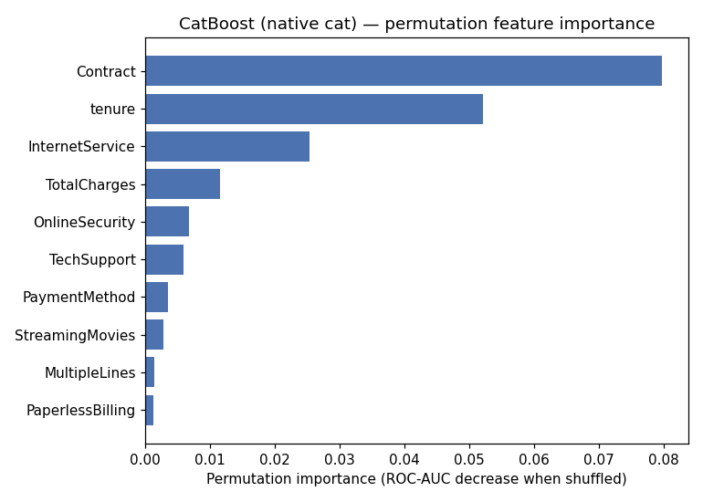
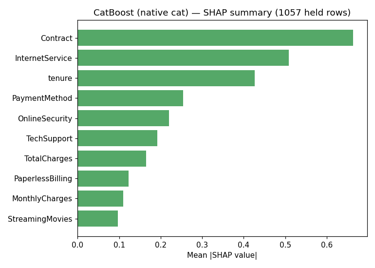

# Stage 8 — Interpretation

## Setup

Explains the CatBoost-native component of the shipped `Blend(LogReg+CatBoost-
native)`, refit on an 85/15 stratified dev/held split, using the fast, exact
`shap.TreeExplainer` directly on the native booster.

**Held-set ROC-AUC (this split): 0.8508** — consistent with the CV mean (0.8477,
see `06-model.md`), so this split is representative, not an easy or hard draw.

## Permutation feature importance (held set, 15 repeats, scored by ROC-AUC drop)

| Feature | Importance |
|---|---|
| Contract | 0.0797 |
| tenure | 0.0522 |
| InternetService | 0.0253 |
| TotalCharges | 0.0116 |
| OnlineSecurity | 0.0068 |

## SHAP summary (1,057 held rows, exact TreeExplainer)

| Feature | Mean \|SHAP\| |
|---|---|
| Contract | 0.664 |
| InternetService | 0.509 |
| tenure | 0.427 |
| PaymentMethod | 0.254 |
| OnlineSecurity | 0.220 |

## Sanity check against domain expectations

**Top-3 agreement between the two methods is exact**: `{Contract, tenure/
InternetService}` — both methods rank `Contract` first, and both put `tenure` and
`InternetService` in the top 3 (order swapped: permutation ranks `tenure` 2nd,
SHAP ranks `InternetService` 2nd — a minor disagreement, not a contradiction).
`OnlineSecurity` appears in both top-5 lists too; `TotalCharges`/`PaymentMethod`
swap in the 4th-5th positions.

**This matches ordinary telecom-churn domain intuition directly**: contract
commitment length and internet service type are the two best-known churn drivers in
this industry, and `/ds-explore`'s Stage 2 bivariate pass independently found the
same two features had the largest raw effect sizes (`Contract`: 42.7% → 2.8% churn
across levels; `InternetService`: 41.9% fiber-optic vs. 7.4% no-internet) — the
model's learned importance ranking and the raw univariate signal agree, which is
reassuring on its own terms even without an external published-dataset comparison
(unlike credit-card-fraud, this dataset's features are directly interpretable, so
the domain check here is a first-class one, not a substitute).

**No implausible driver.** No feature dominates in a way suggesting leakage (no
single feature approaches the near-total-dominance pattern `ds-method` warns
about — `Contract`'s SHAP share, while the largest, is a fraction of total
attribution across ten-plus features), and no feature re-check against `/ds-prep`'s
known-at-prediction-time list is triggered.
