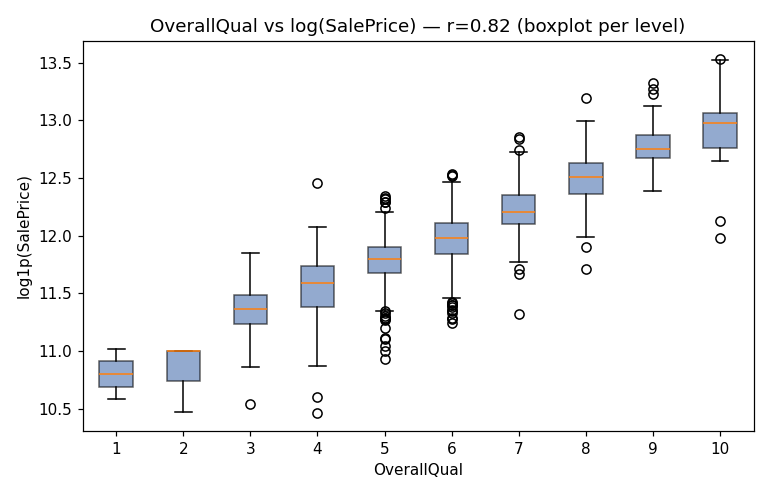
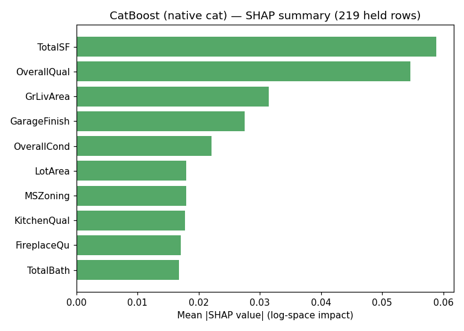
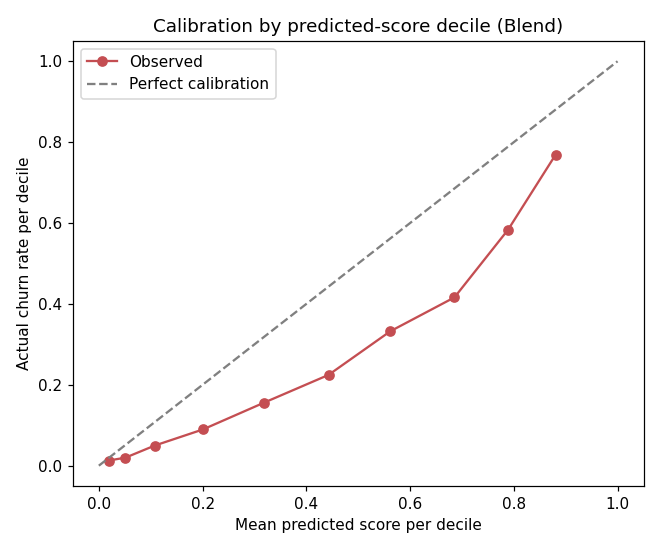
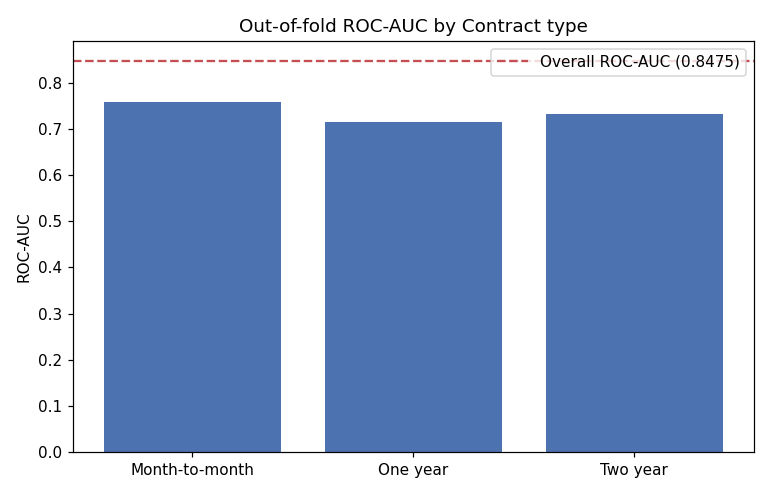
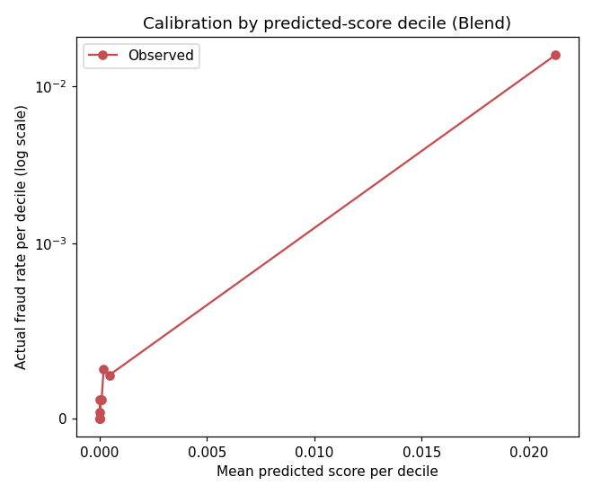
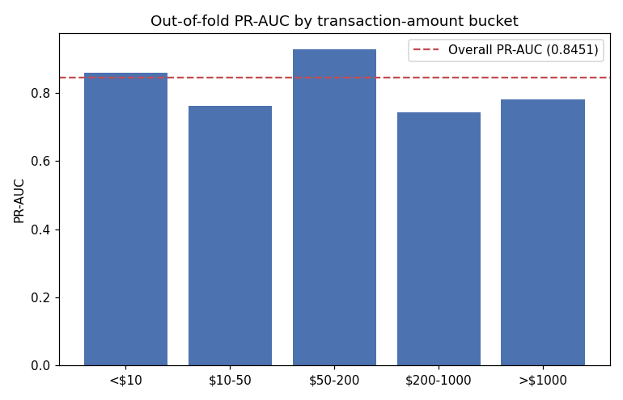

# Showcase

A curated look at what running the full `/ds-frame`→`/ds-handoff` pipeline actually
produces — three real Kaggle/public datasets, each taken all the way through the
pipeline. This folder holds a hand-picked selection of figures; the full run (every
stage's evidence doc, every figure, every script) lives in
[`benchmarks/`](../benchmarks/).

See the main [README](../README.md#benchmarks) for the results table, reliability
numbers, and comparison against published reference scores.

---

## House Prices (regression)

Shipped model: `Blend(LightGBM + CatBoost-native)` — RMSE 0.1244 ± 0.0141 (log-space).
Full run: [`benchmarks/house-prices/.last-ds-mile/stages/`](../benchmarks/house-prices/.last-ds-mile/stages/).

| | |
|---|---|
|  | **`/ds-explore`**: a boxplot, not a scatter, for an ordinal-vs-continuous relationship — a raw scatter on a 10-level ordinal overplots into unreadable vertical stripes. |
|  | **`/ds-evaluate`**: row-level scatter plotted *behind* the decile-mean trend line, so real dispersion is visible rather than smoothed away by aggregation. |
|  | **`/ds-evaluate`**: the cheapest price quintile is a real, named weak spot — not buried in the aggregate RMSE. |
|  | **`/ds-explain`**: exact `TreeExplainer` SHAP on the CatBoost component — total square footage and overall quality dominate, matching ordinary real-estate intuition. |

## Telco Customer Churn (classification, moderate imbalance)

Shipped model: `Blend(LogReg + CatBoost-native)` — ROC-AUC 0.8477 ± 0.0113.
Full run: [`benchmarks/telco-churn/.last-ds-mile/stages/`](../benchmarks/telco-churn/.last-ds-mile/stages/).

| | |
|---|---|
|  | **`/ds-evaluate`**: raw scores rank well (AUC) but systematically *overstate* churn probability mid-range — flagged explicitly rather than left as a silent trap for anyone using the score as a literal probability. |
|  | **`/ds-evaluate`**: every `Contract` slice scores below the overall AUC — the model discriminates well *between* risk segments but worse *within* the riskiest one. |
|  | **`/ds-explain`**: `Contract` and `InternetService` dominate, matching both textbook telecom-churn knowledge and this run's own EDA — see `causal-vs-predictive` for why "Contract predicts churn" and "shortening contracts causes churn" are not the same claim. |

## Credit Card Fraud (classification, severe imbalance)

Shipped model: `Blend(LightGBM + CatBoost)` — PR-AUC 0.8455 ± 0.0117.
Full run: [`benchmarks/credit-card-fraud/.last-ds-mile/stages/`](../benchmarks/credit-card-fraud/.last-ds-mile/stages/).

| | |
|---|---|
|  | **`/ds-evaluate`**: log-scale calibration at 0.17% base rate — the bottom 9 deciles correctly cluster near zero; the real signal lives entirely in the top decile. |
|  | **`/ds-evaluate`**: PR-AUC by transaction-amount bucket, with an explicit small-sample-size caution (as few as 9 fraud cases in the largest bucket). |
|  | **`/ds-explain`**: top features (`V14`, `V12`, `V10`) can't be domain-checked directly (PCA-anonymized) — cross-checked against independently published analyses of this exact dataset instead, the closest available substitute. |

---

## What caught real problems along the way

Not everything in these three runs worked on the first pass — recorded here rather
than quietly fixed and forgotten:

- **LightGBM collapsed** (PR-AUC 0.04 vs. 0.82+ for every other candidate) on the
  fraud dataset's ~600:1 imbalance ratio — `scale_pos_weight` hit a numerical wall
  that `class_weight="balanced"` didn't. See
  [`lessons/the-imbalance-knob-that-broke-silently.md`](../lessons/the-imbalance-knob-that-broke-silently.md).
- **A causal overreach** ("contract commitment *reduces* churn... confirmed") made
  it into an early EDA writeup from a purely correlational comparison, missing the
  obvious self-selection confound. See
  [`lessons/the-contract-that-wasnt-the-cause.md`](../lessons/the-contract-that-wasnt-the-cause.md).

Both are now permanent checks in the pipeline (`ds-model`'s Red Flags,
`causal-vs-predictive`), not one-off fixes.

## What a non-technical brief looks like

`/ds-brief` translates `/ds-report` into a one-page, jargon-free version for anyone
without a DS background — no metric names, dollar/percentage/count framing only.
Real examples, not just the skill description: [house-prices](../benchmarks/house-prices/.last-ds-mile/stages/09b-brief.md),
[telco-churn](../benchmarks/telco-churn/.last-ds-mile/stages/09b-brief.md),
[credit-card-fraud](../benchmarks/credit-card-fraud/.last-ds-mile/stages/09b-brief.md).
